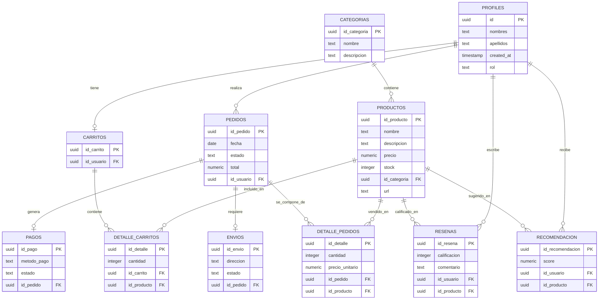

# NeuxFlow

Base inicial de React para la plataforma de comercio electrónico **NeuxFlow**, pensada para una materia de usabilidad y accesibilidad con enfoque en WCAG 2.2 y heurísticas de Nielsen.

## Estructura base

- `src/app`: composición de la aplicación y arranque.
- `src/pages`: pantallas o rutas de alto nivel.
- `src/widgets`: bloques de interfaz reutilizables.
- `src/features`: casos de uso del negocio.
- `src/entities`: modelos del dominio.
- `src/shared`: utilidades, estilos y componentes compartidos.

## Diagrama ER

## Criterios de diseño y accesibilidad

- Usar HTML semántico antes que contenedores genéricos.
- Mantener navegación completa con teclado.
- Asegurar contraste suficiente y estados visibles de foco.
- No depender solo del color para comunicar estado o prioridad.
- Validar texto alternativo, nombres accesibles y mensajes claros.
- Revisar cada pantalla contra WCAG 2.2.
- Aplicar las 10 heurísticas de Nielsen como guía de experiencia: visibilidad del estado, correspondencia con el mundo real, control del usuario, consistencia, prevención de errores, reconocimiento antes que recuerdo, flexibilidad, minimalismo, ayuda ante errores y documentación útil.

## Estado de SonarQube (actualizado el 2026-07-07)

- Se corrigió el issue reportado en [src/main.tsx](src/main.tsx) que estaba generando un code smell en SonarQube.
- También se resolvieron conflictos de merge en [src/shared/context/AccessibilityContext.tsx](src/shared/context/AccessibilityContext.tsx) y [src/pages/SupportPage.tsx](src/pages/SupportPage.tsx), lo que permitió recuperar la ejecución de pruebas y la compilación.
- El análisis previo mostraba: 0 bugs, 0 vulnerabilities, 1 code smell, 0 duplicaciones y 0.0% de coverage.
- La corrección realizada elimina la alerta de tipo de aserción innecesaria, añade una validación explícita del contenedor raíz y restaura la lógica de accesibilidad sin conflictos.

## Pendientes para cerrar la revisión

- Ejecutar un nuevo análisis en SonarQube tras subir los cambios.
- Mejorar la cobertura de tests para subir el porcentaje de coverage desde 0.0%.
- Revisar si aparecen nuevos code smells tras el nuevo escaneo.

## Siguiente paso sugerido

Instalar dependencias y arrancar el proyecto con `npm install` y `npm run dev`.
